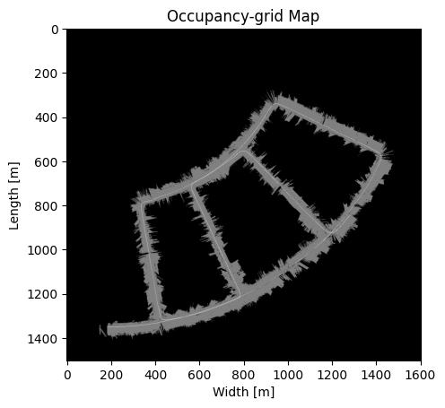

# Particle-Filter-SLAM-and-Texture-Mapping
## Particle Filter Simultaneous Localization and Mapping (SLAM) and Texture Mapping Project
Particle filter simultaneous localization and mapping (SLAM) is implemented to localize the robot and build a 2-D occupancy grid map of the environment given that the odometry, 2-D LiDAR scans, and stereo camera data from an autonomous vehicle are provided in the links below:
- param.zip: https://drive.google.com/file/d/1alGT4ZJcNKCLLLW-DIbt50p8ZBFrUyFZ/view?usp=sharing
- sensor data.zip: https://drive.google.com/file/d/1s82AV_TACqqgCJaE6B561LL1rgWmewey/view?usp=sharing
- stereo images.zip: https://drive.google.com/file/d/1kJHOm9-1Zz13rUBg46D3RS1TOeXZEhQS/view?usp=sharing

Texture mapping is also part of the particle filter SLAM algorithm to add RGB texture to the occupancy-grid map given that the stereo camera images are provide in the link above.

## Particle Filter SLAM result

## Requirement to run the "particle_filter_SLAM.py":
1.) Download the data above and store them in the "data" folder.

## How to Run "Particle Filter SLAM and Texture Mapping"?
1.) Open up the "particle_filter_SLAM.py".

2.) Run the "particle_filter_SLAM.py" code to perform particle filter SLAM and texture mapping by default.

3.) It will output and save the Occupancy-grid Map with Vehicle Trajectory and Textured Map

## Parameters that Can be Changed:
1.) texture_mapping_settings (Line 27)
- True -> Activate Texture Mapping for the Particle Filter SLAM Algorithm.
- False -> Deactivate Texture Mapping for the Particle Filter SLAM Algorithm.

2.) num_Particles (Line 135)
- integer type
- Recommended range (1 - 300)
- Higher the number of particles, slower the program runs.
- Lower the number of particles, faster the program runs.

## "particle_filter_SLAM.py" Description:
- Initialize Occupancy-grid map, textured map (RGB Occupancy-grid Map).
- Initialize Vehicle Pose.
- Initialize Particles Poses and Weights.
- Load FOG, Encoders, and Stereo Camera data and parameters.
- Syncs Encoders, FOG, and Stereo Camera timestamps.
- Perform Mapping by calling occupancy_grid_mapping() function from the "mapping.py".
- Perform Particle Filter Prediction Step by calling predict() function from "prediction_update.py".
- Perform Particle Filter Update Step by calling update() function from "prediction_update.py".
- Perform Texture Mapping by calling texture_map() function from "texture_mapping.py"
- Perform Particle Resampling by calling resample() function from "resampling.py"

## "mapping.py" Description:
- occupancy_grid_mapping() -> Update the occupancy-grid map log-odds.
                                * Convert the scan to cartesian coordinates.
                                * Transform the scan from the lidar frame to the body frame and then to the world frame.
                                * Convert the scan to cells (via bresenham2D from "pr2_utils" or cv2.drawContours) and update the map log-odds.
- display_Occupancy_Grid_Map() -> Display Occupancy Grid Map.
- transformation_matrix() -> Convert to a 4 x 4 transformation matrix with the rotation matrix and translation vector.
- filter_lidar_pts_cloud() -> Filters out invalid 2-D LIDAR observation points that not within the 2-D LIDAR Measurement Range. 

## "prediction_update.py" Description:
- predict() -> Predict the next step of vehicle position x at t+1.
- update() -> Combines Robot State and Map Update.
                * Use the laser scan from each particle to compute map correlation (via getMapCorrelation) and update the particle weights.
                * Choose the particle with largest weight α(k)t|t, project the laser scan zt to the world frame and update the map log-odds.

## "prediction_update.py" Description:
- resample() -> Resample particle poses and particle weights using Stratified and Systematic Resampling method.

## "texture_mapping.py" Description:
- texture_map() -> Compute a disparity image from stereo image pairs using the provided script in p2 utils.py and estimate depth for each pixel via the stereo camera model. Project colored points from the left camera onto your occupancy grid in order to color it. Display Textured Map.

## "pr2_utils.py" Description:
- tic() -> Start timer.
- toc() -> End timer.
- compute_stereo() -> Compute disparity image with RGB stereo images.
- read_data_from_csv() -> Read sensors data from csv files
- mapCorrelation() -> Get the map correlation with the observation points in world frame, and map.
- bresenham2D() -> Bresenham's ray tracing algorithm in 2D.
- test_bresenham2D() -> Test bresenham2D() function.
- test_mapCorrelation() -> Test mapCorrelation() function.
- show_lidar() -> Plot and display 2-D LIDAR measurements.